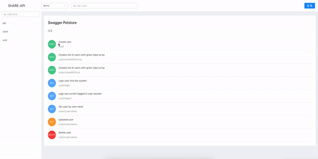

# Share API

[查看中文README](/README_CN.md)

## Introduction

Based on Swagger and Swagger Open API 3.0 Specification, a tool for generating API documentation by configuring Swagger JSON.

## Features

- More friendly UI
- More intuitive display
- Support for `enum` display
- Support for both public and private displays
- Support for configuring IP access whitelist for private API documentation 
- Support for privatization deployment



## Quick Start

> Providing 2 ways to start

#### 1. Install from npm

1. Download npm Package

```
npm i @shuangren/share-api
yarn add @shuangren/share-api
```

2. Create new js file and import

```
// index.js
const ApiDoc = require('@shuangren/share-api');
const doc = new ApiDoc();
doc.start();
```

3. Startup

```
node index.js
```

#### Install from Git

1. Clone repository

```
git clone https://github.com/ShuangRen/share-api.git
```
2. Install dependencies

```
npm install
yarn
```

3. Startup

```
node dist/server/start.js
```

## Extended configuration

#### Install from npm

```
// index.js
const ApiDoc = require('@shuangren/share-api');
const doc = new ApiDoc();
doc.config({
  port: '3001',
  password: 'abc123',
  dataPath: '/var/demo/data.config'
});
doc.start();
```

#### Install from Git 

Directly modify the configuration in the file `dist/server/config` 


## Configuration instructions

`dataPath`  data file that caches interface configuration list , Default `dist/server` 

`password` password when switched to internal access mode, Default is `123456`

`port` start port  Default is `8081`

`ipList` An IP list that runs direct internal access, Default is `[]`

## Whole configuration reference

```
doc.config({
  port: '3001',
  password: 'abc123',
  dataPath: '/var/demo/data.config'
  ipList:[
    '192.168.1.111',
    '21.221.1.111'
  ]
});
```
