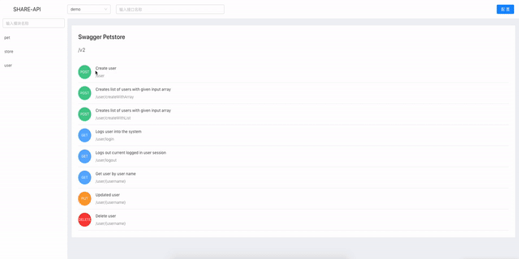

# Share API


[查看中文README](/README_CN.md)

For Swagger, Swagger open api 3.0 specification, API documentation by configuring Swagger JSON.

[View Change Logs](/changelog.md)

More friendly interface

More intuitive display

Support for enum display

Support for public, private, different displays

Support for configuring private API documentation ip access whitelist

Support privatization



## Installation

> Provide 2 ways to start

#### 1. Install from npm

1. Download npm Package

```
npm i @shuangren/share-api
yarn add @shuangren/share-api
```

2. Create new js file and import

```
// index.js
const ApiDoc = require('@shuangren/share-api');
const doc = new ApiDoc();
doc.start();
```

3. Startup

```
node index.js
```

#### Install from Git

1. Clone  repository

```
git clone https://github.com/ShuangRen/share-api.git
```
2. Install dependencies

```
npm install
yarn
```

3. Startup

```
node dist/server/start.js
```

## Extended configuration

#### Install from npm

```
// index.js
const ApiDoc = require('@shuangren/share-api');
const doc = new ApiDoc();
doc.config({
  port: '3001',
  password: 'abc123',
  dataPath: '/var/demo/data.config'
});
doc.start();
```

#### Install from Git 

Directly modify the configuration in the file `dist/server/config` 


## Configuration instructions

`dataPath`  Cache interface configuration list data file, Default in `dist/server` 

`password` Switch to password for internal access, Default is `123456`

`port` start port  Default is `8081`

`ipList` An ip list that runs direct internal access, Default is `[]`

## Full configuration reference

```
doc.config({
  port: '3001',
  password: 'abc123',
  dataPath: '/var/demo/data.config'
  ipList:[
    '192.168.1.111',
    '21.221.1.111'
  ]
});
```
